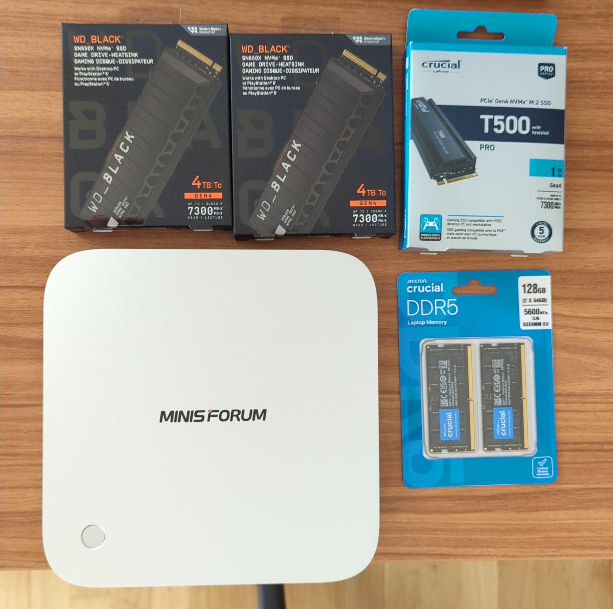
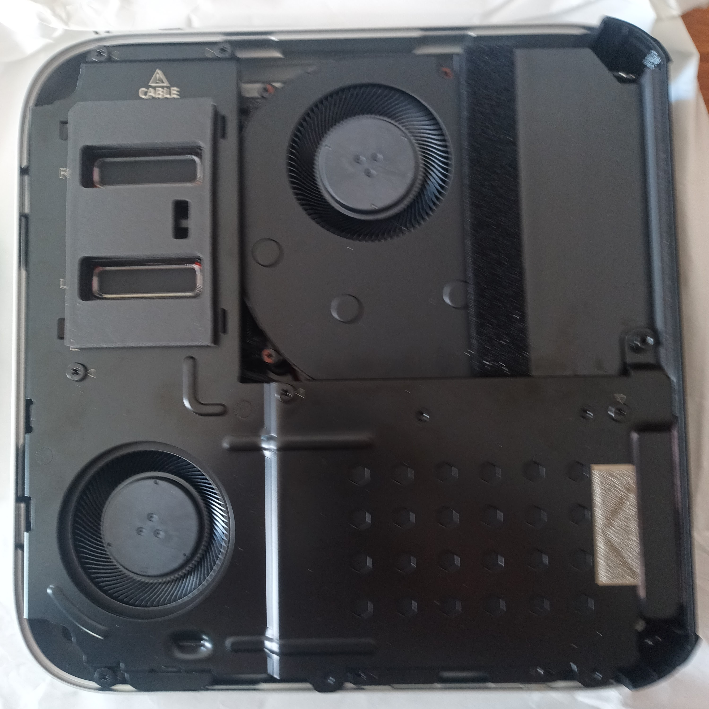
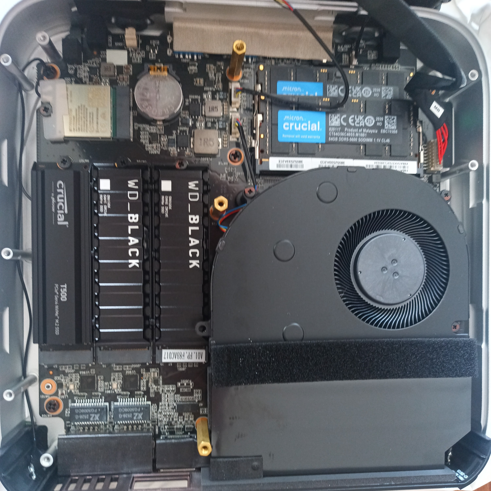
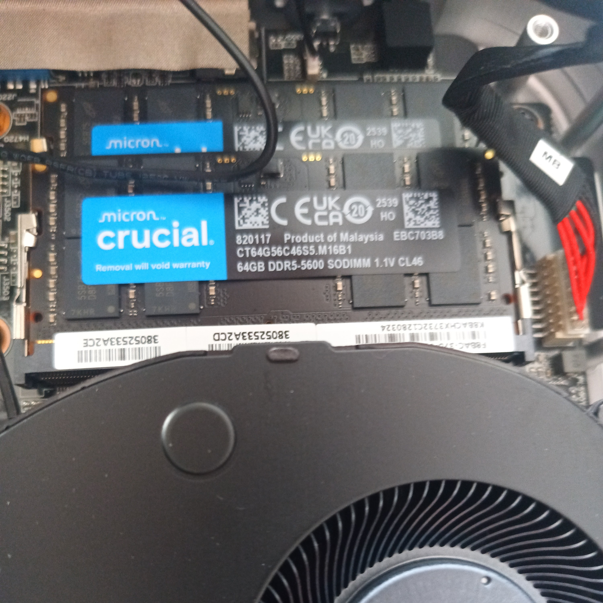
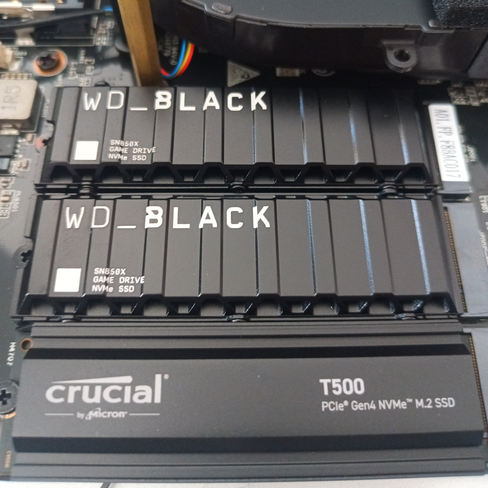

import { Aside } from 'astro-pure/user'

I chose a [Minisforum AI X1 Pro](https://www.minisforum.com/it/products/minisforum-ai-x1-pro) as my home server.
I bought it on Amazon during the Black Friday 2025 discounts, along with [128 GB Crucial DDR5 SODIMM SDRAM](https://it.crucial.com/memory/ddr5/ct2k64g56c46s5)
and three nvme disks: two [4 TB WD Black SN850X](https://documents.westerndigital.com/content/dam/doc-library/en_us/assets/public/western-digital/product/internal-drives/wd-black-ssd/data-sheet-wd-black-sn850x-nvme-ssd.pdf)
and one [1 TB Crucial T500 Pro](https://it.crucial.com/ssd/t500/ct1000t500ssd8) (all with heat sinks).

## Opening

The installation of all components is trivial. You need to unscrew the screws at the bottom (one is hidden under a rubber pad),
then remove the metal case, and finally unscrew the cooler.

<Aside type='caution'>Lift the cooler carefully, without pulling the cable connecting it to the motherboard below.</Aside>

Under the cooler and around the power supply, you can find the interfaces of memories and disks.

## Memory

There is little room for your fingers, but installing the two RAM memory modules is quite easy.

## Disks

Installing NVME disks is also easier.

<Aside type='note'>
    Only the first two interfaces are fully PCIe Gen4x4, the third one is a slower PCIe Gen4x1.
    I will use the formers for data and the latter for system files.
</Aside>

## Closing

That's all, now you can again secure the cooler and metal cover with screws.
