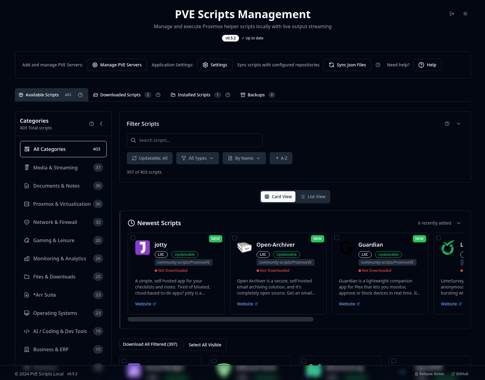
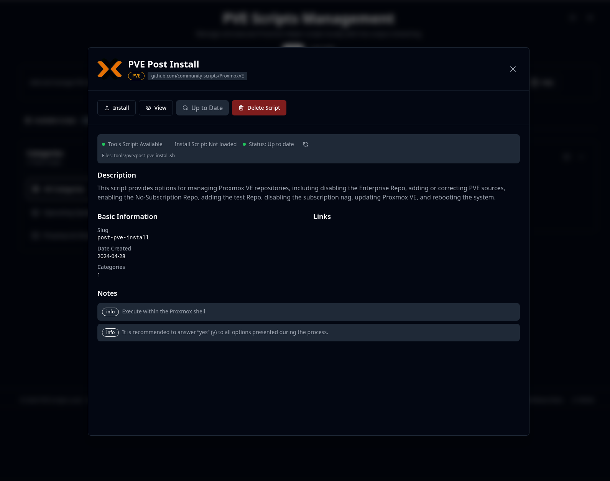

[PVE Helper Scripts](https://community-scripts.github.io/ProxmoxVE/) is a valuable project that simplifies Proxmox management.
You can search for the script you need using the official repository,
but I chose to [install it locally](https://github.com/community-scripts/ProxmoxVE-Local).

## Installation

From the server shell, run the following script that spins up a pre-configured LXC container.

```shell
bash -c "$(curl -fsSL https://raw.githubusercontent.com/community-scripts/ProxmoxVE/main/ct/pve-scripts-local.sh)"
```

Check the IP assigned to the new LXC container and browse to `http://192.168.X.Y:3000`.



## Usage

You can browse the repository and search for the scripts you need. Then you can download and run them from the web interface.

The first one I suggest you to run is [PVE Post Install](https://community-scripts.github.io/ProxmoxVE/scripts?id=post-pve-install).

> This script provides options for managing Proxmox VE repositories, including disabling the Enterprise Repo, adding or correcting PVE sources, enabling the No-Subscription Repo, adding the test Repo, disabling the subscription nag, updating Proxmox VE, and rebooting the system.


