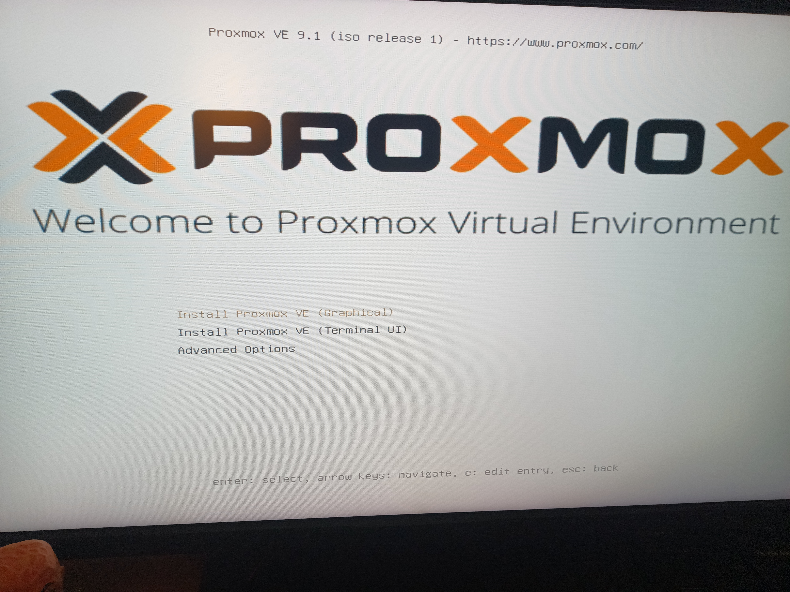
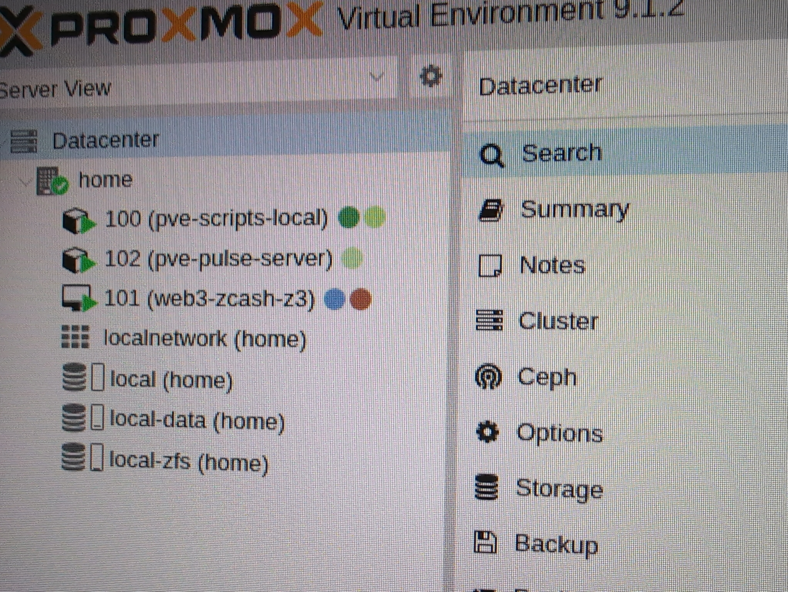

import { Aside, Steps } from 'astro-pure/user'

[Proxmox Virtual Environment](https://proxmox.com/en/products/proxmox-virtual-environment/overview) is a leading open-source server management platform for virtualization.

## Download the installer

I assume you are using a Linux-based computer connected to Internet.

<Aside>
    Proxmox VE is a bare-metal installer, please be aware that the complete server is used and existing data on the selected disks will be removed.
</Aside>

<Steps>
    1. Download the [official ISO image](https://proxmox.com/en/products/proxmox-virtual-environment/get-started).
    2. Insert your empty stick on an USB port
    3. Locate the device name: `lsblk`
    4. Copy the image to the stick: `dd bs=1M conv=fdatasync if=proxmox-ve_9.1-1.iso of=/dev/sdX` (adjust file and device names)
    5. Unmount and remove the stick
</Steps>

## Boot the server

You need to plug a screen and a keyboard and connect your server to Internet to properly install the system.

<Steps>
    1. Insert your bootable stick on an USB port
    2. Power on the server and wait until the installer shows up
    3. You can use the graphical interface to continue
</Steps>

<Aside>
    I didn't need any workaround (ie. no `nomodeset` kernel parameter) to boot from the USB stick or to run the installer.
</Aside>

## Configure installation

You can simply follow the installation wizard and customize configuration for your needs.
I used the whole Crucial T500 Pro disk (1 TB with [ZFS](https://en.wikipedia.org/wiki/ZFS))
for the system installation and to store VM and CT images.

## Reboot

At the end of the installation process, reboot the server and remove the USB stick.
Now you can also unplug screen and keyboard, the Proxmox graphical interface is available as a web application on port `8006`.

<Aside type="tip">
    Make the local IP assigned to your server as static, so you can save it once (ie. in ssh config or as browser bookmark).
</Aside>

