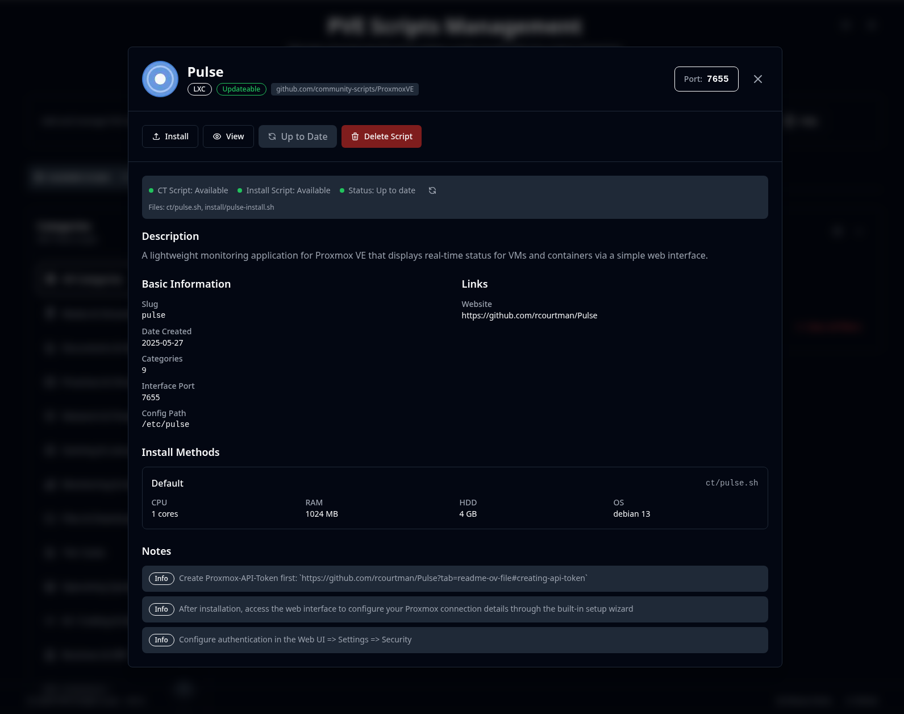
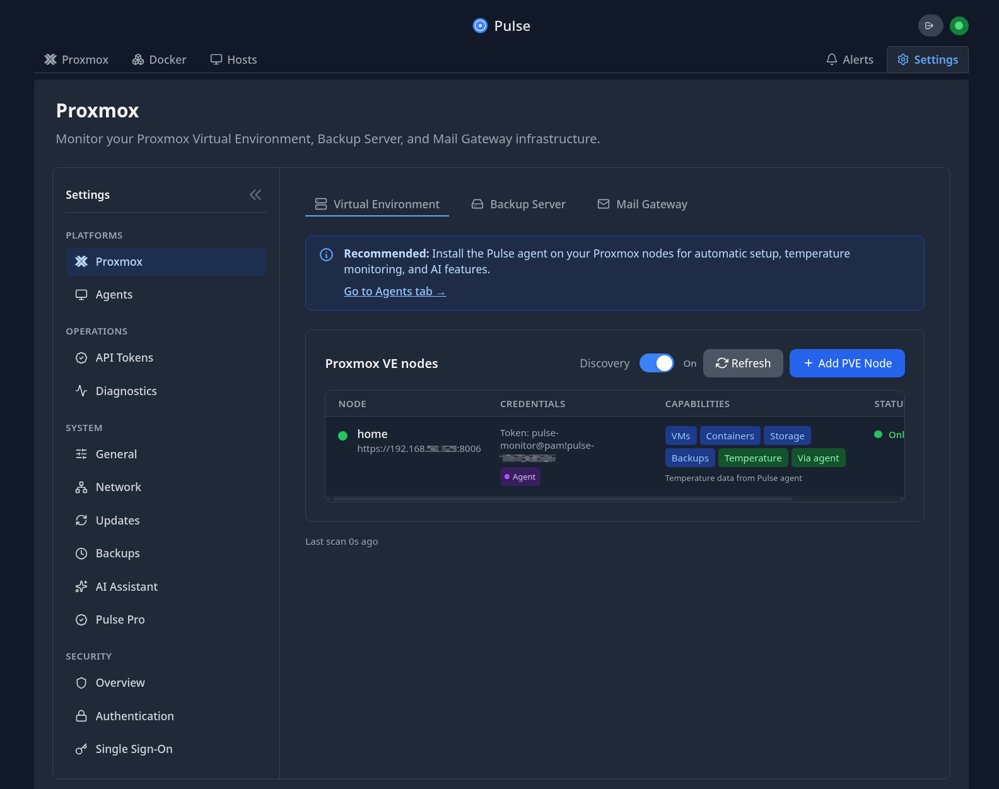
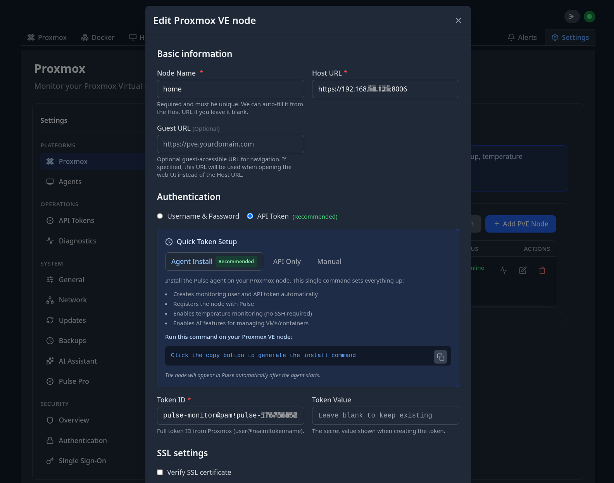
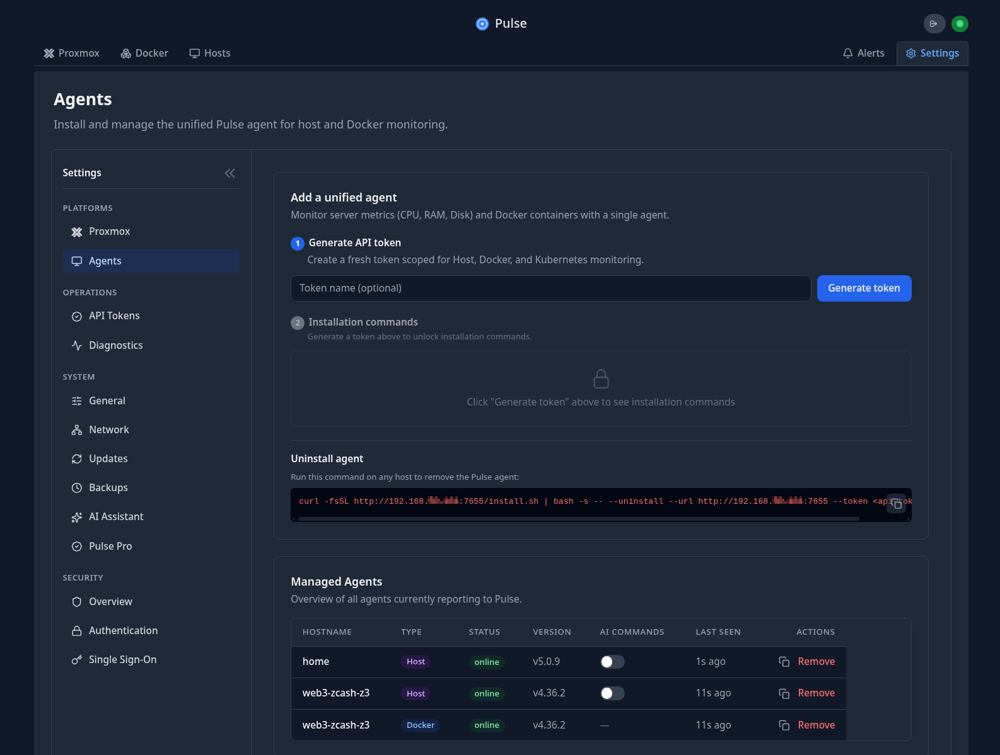
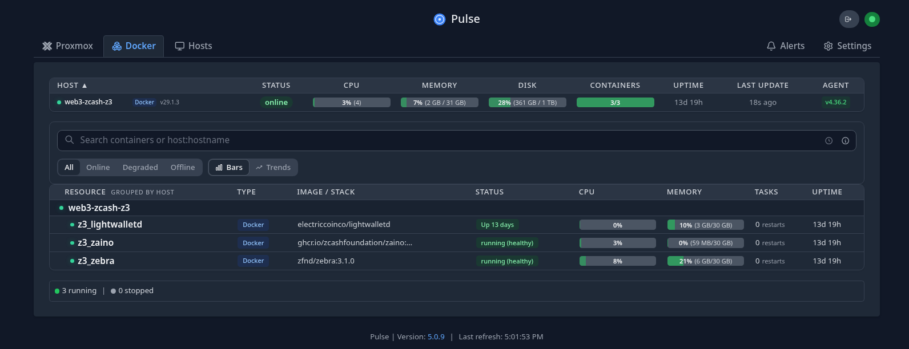

import { Aside } from 'astro-pure/user'

[Pulse](https://github.com/rcourtman/Pulse) is a full-featured real-time monitoring tool for Proxmox, Docker, and Kubernetes infrastructure.
I'm using it to monitor Proxmox server, VMs and LXCs, docker containers living inside the VMs.

## Installation

Use the [helper script](https://community-scripts.github.io/ProxmoxVE/scripts?id=pulse) and follow the instructions.

<Aside>
    The latest version doesn't need the Proxmox API Token because of an auto-discovery feature.
</Aside>

## Setup

Check the IP assigned to the new LXC container, browse to `http://192.168.X.Y:7655`, and go to Settings.

Use the auto-discovery feature to locate your Proxmox node, then set it up using Agent install.

With the Proxmox agent you can also monitor VMs and CTs, but if you want more control over processes running inside a VM,
you can manually install additional agents in them.

For example, if you use Docker inside a VM, you can monitor status and resources for each container.

